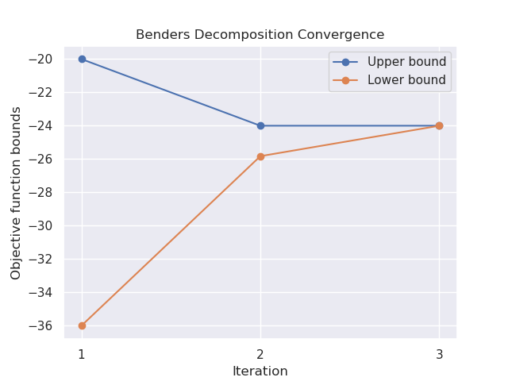

# Benders decomposition

Implementation of the Benders decomposition method for solving Mixed-Integer Linear 
Programs (MILPs) of the following form:


$$
\\begin{aligned}
\\min\_{x,y} \\quad & c\^Tx + f\^Ty  \\\\
\\textrm{s.t.} \\quad 
 & Ax + By \\ge b\\\\
 & Dy \\ge d \\\\
 & x \\ge 0  \\\\
 & y \\ge 0  \\\\
 & y \\text{ integer}
\\end{aligned}
$$

About
-----
The idea behind Benders decomposition is to take advantage of the problem's block structure
and decompose it to simpler problems (divide-and-conquer technique) in order to solve 
very large optimization problems efficiently. 
The way this method works is by dividing the variables into two subsets such that 
a Master problem (MP) is solved over the first set of variables and a sub-problem (SP)
is solved over the second set of variables given the solution of the Master problem.
It is an iterative method that utilizes duality to solve the sub-problems and at 
each iteration either adds an optimality or a feasibilty cut to the MP,
until the upper and lower bounds of the objective function converge.  


Example
-------
The following problem can be written in the above form and thus solved by this solver.

$$
\\begin{aligned}
\\min\_{x,y} \\quad & -4x-3y-5z  \\\\
\\textrm{s.t.} \\quad 
 & -2x-3y-z \\ge -12\\\\
 & -2x-y-3z \\ge -12 \\\\
 & -z \\ge -20  \\\\
 & x,y,z \\ge 0  \\\\
 & z \\text{ integer}
\\end{aligned}
$$

The algorithm's convergence for the given example is shown in the following figure:
<br>
<p align="center" width="100%">
    
    <br>Convergence plot
</p>


Technologies
------------
The project was created with:
* Python 3.9
* cvxpy 1.2.1
* matplotlib 3.6.2
* numpy 1.23.4
* seaborn 0.11.2

Installation
------------

To use this project, install it locally via:
```
git clone https://github.com/elena-ecn/benders-decomposition.git
```

The dependencies can be installed by running:
```
pip install -r requirements.txt
```

**Note**: This project is utilizing the MOSEK solver which requires a license to use. 
However, you can use any other compatible solver to solve the optimization problems. 
See [here](https://www.cvxpy.org/related_projects/index.html#solvers) for more information.

To execute the code, run:
```
python3 main.py
```

License
-------
The contents of this repository are covered under the [MIT License](LICENSE).